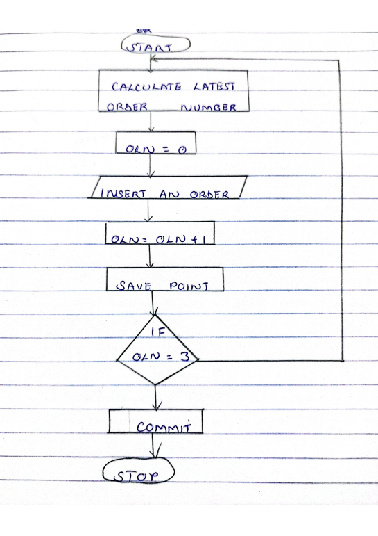

# BBT3104-Lab1of6-DatabaseTransactions

| **Key**                                                               | Value                                                                                                                                                                              |
|---------------|---------------------------------------------------------|
| **Group Name**  a1                                                             | ? |
| **Semester Duration**                                                 | 19th August - 25th November 2024                                                                                                                       |

## Flowchart

## Pseudocode
START
  STEP1:CALCULATE LATEST ORDER NUMBER;
  STEP2:ORDER LINE NUMBER=0;
  STEP3:INSERT AN ORDER;
  STEP4:ORDER LINE NUMBER=ORDER LINE NUMBER+1;
  STEP5:SAVE POINT;
  STEP6:IF ORDER LINE NUMBER=3 COMMIT
        6.1 OTHERWISE GO BACK TO STEP 1;
STOP
## Support for the Sales Departments' Report
To improve the database design for tracking unpaid orders and remaining balances, the following steps can be taken:

Create a Payments Table: Add a table to track multiple payments for each order, including fields like PaymentID, OrderID, PaymentDate, and AmountPaid.
Add TotalAmount Field in Orders Table: Ensure the Orders table has a TotalAmount field representing the full amount owed for each order.
Implement a Calculated Balance Field: Use a query to calculate the remaining balance by subtracting the total payments from the TotalAmount or store it in the Orders table, updated with each payment.
Add Payment Status: Include a PaymentStatus field in the Orders table to track whether an order is Paid, Partially Paid, or Not Paid.
Generate a Report: Create a report that lists all orders with outstanding balances, along with customer details, total paid, balance remaining, and last payment date.
This design enables clear tracking of payments and generates useful reports for the sales team to follow up on outstanding balances.